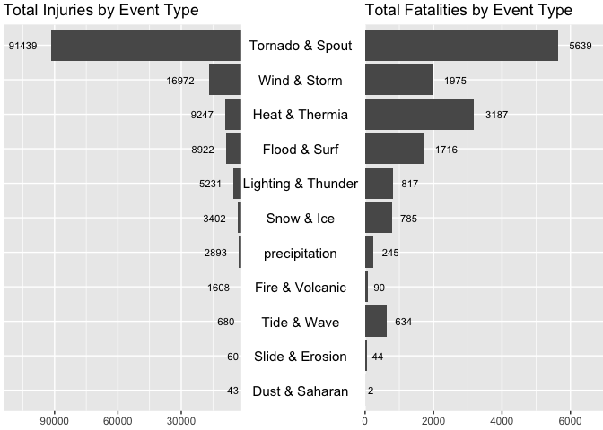
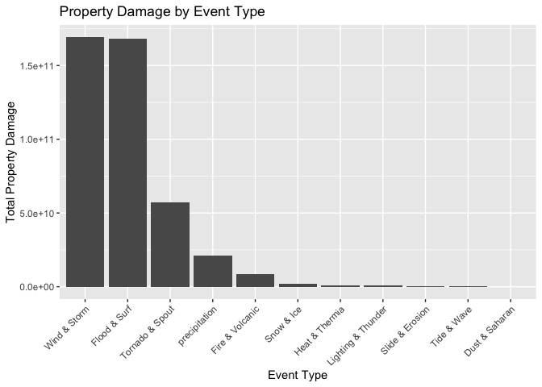

By Zhenghao Xiao

``` r
knitr::opts_chunk$set(echo = TRUE)
```

Synopsis
--------

Storms and other severe weather events can cause both public health and
economic problems for communities and municipalities. Many severe events
can result in fatalities, injuries, and property damage, and preventing
such outcomes to the extent possible is a key concern.

The analysis is based on U.S. National Oceanic and Atmospheric
Administration’s (NOAA) storm database. As a result, among all the
severe weather types, Tornado and Spout contributed to most human
injuries and fatalities while Wind and Storm caused the greatest
economic damages followed by Flood and Surf.

Data Processing
---------------

``` r
setwd("/Users/zhenghaoxiao/Documents/R/jhu/RR_project2/")
library(tidyverse)
library(grid)
library(gridExtra)
library(scales)
```

### Download Data

``` r
download_data <- function(){      
      file_name <<- "repdata-data-StormData.csv.bz2"
      if (!file.exists(file_name)) {
            file_url <- "https://d396qusza40orc.cloudfront.net/repdata%2Fdata%2FStormData.csv.bz2"
            download.file(file_url, file_name, method = "curl")
      }
}

download_data()
```

### Load Data

``` r
storm <- read_csv(file_name)
```

### Have a look of the data

``` r
glimpse(storm)
```

    ## Observations: 902,297
    ## Variables: 37
    ## $ STATE__    <dbl> 1, 1, 1, 1, 1, 1, 1, 1, 1, 1, 1, 1, 1, 1, 1, 1, 1, 1,…
    ## $ BGN_DATE   <chr> "4/18/1950 0:00:00", "4/18/1950 0:00:00", "2/20/1951 …
    ## $ BGN_TIME   <chr> "0130", "0145", "1600", "0900", "1500", "2000", "0100…
    ## $ TIME_ZONE  <chr> "CST", "CST", "CST", "CST", "CST", "CST", "CST", "CST…
    ## $ COUNTY     <dbl> 97, 3, 57, 89, 43, 77, 9, 123, 125, 57, 43, 9, 73, 49…
    ## $ COUNTYNAME <chr> "MOBILE", "BALDWIN", "FAYETTE", "MADISON", "CULLMAN",…
    ## $ STATE      <chr> "AL", "AL", "AL", "AL", "AL", "AL", "AL", "AL", "AL",…
    ## $ EVTYPE     <chr> "TORNADO", "TORNADO", "TORNADO", "TORNADO", "TORNADO"…
    ## $ BGN_RANGE  <dbl> 0, 0, 0, 0, 0, 0, 0, 0, 0, 0, 0, 0, 0, 0, 0, 0, 0, 0,…
    ## $ BGN_AZI    <lgl> NA, NA, NA, NA, NA, NA, NA, NA, NA, NA, NA, NA, NA, N…
    ## $ BGN_LOCATI <lgl> NA, NA, NA, NA, NA, NA, NA, NA, NA, NA, NA, NA, NA, N…
    ## $ END_DATE   <lgl> NA, NA, NA, NA, NA, NA, NA, NA, NA, NA, NA, NA, NA, N…
    ## $ END_TIME   <lgl> NA, NA, NA, NA, NA, NA, NA, NA, NA, NA, NA, NA, NA, N…
    ## $ COUNTY_END <dbl> 0, 0, 0, 0, 0, 0, 0, 0, 0, 0, 0, 0, 0, 0, 0, 0, 0, 0,…
    ## $ COUNTYENDN <lgl> NA, NA, NA, NA, NA, NA, NA, NA, NA, NA, NA, NA, NA, N…
    ## $ END_RANGE  <dbl> 0, 0, 0, 0, 0, 0, 0, 0, 0, 0, 0, 0, 0, 0, 0, 0, 0, 0,…
    ## $ END_AZI    <lgl> NA, NA, NA, NA, NA, NA, NA, NA, NA, NA, NA, NA, NA, N…
    ## $ END_LOCATI <lgl> NA, NA, NA, NA, NA, NA, NA, NA, NA, NA, NA, NA, NA, N…
    ## $ LENGTH     <dbl> 14.0, 2.0, 0.1, 0.0, 0.0, 1.5, 1.5, 0.0, 3.3, 2.3, 1.…
    ## $ WIDTH      <dbl> 100, 150, 123, 100, 150, 177, 33, 33, 100, 100, 400, …
    ## $ F          <dbl> 3, 2, 2, 2, 2, 2, 2, 1, 3, 3, 1, 1, 3, 3, 3, 4, 1, 1,…
    ## $ MAG        <dbl> 0, 0, 0, 0, 0, 0, 0, 0, 0, 0, 0, 0, 0, 0, 0, 0, 0, 0,…
    ## $ FATALITIES <dbl> 0, 0, 0, 0, 0, 0, 0, 0, 1, 0, 0, 0, 1, 0, 0, 4, 0, 0,…
    ## $ INJURIES   <dbl> 15, 0, 2, 2, 2, 6, 1, 0, 14, 0, 3, 3, 26, 12, 6, 50, …
    ## $ PROPDMG    <dbl> 25.0, 2.5, 25.0, 2.5, 2.5, 2.5, 2.5, 2.5, 25.0, 25.0,…
    ## $ PROPDMGEXP <chr> "K", "K", "K", "K", "K", "K", "K", "K", "K", "K", "M"…
    ## $ CROPDMG    <dbl> 0, 0, 0, 0, 0, 0, 0, 0, 0, 0, 0, 0, 0, 0, 0, 0, 0, 0,…
    ## $ CROPDMGEXP <lgl> NA, NA, NA, NA, NA, NA, NA, NA, NA, NA, NA, NA, NA, N…
    ## $ WFO        <lgl> NA, NA, NA, NA, NA, NA, NA, NA, NA, NA, NA, NA, NA, N…
    ## $ STATEOFFIC <lgl> NA, NA, NA, NA, NA, NA, NA, NA, NA, NA, NA, NA, NA, N…
    ## $ ZONENAMES  <lgl> NA, NA, NA, NA, NA, NA, NA, NA, NA, NA, NA, NA, NA, N…
    ## $ LATITUDE   <dbl> 3040, 3042, 3340, 3458, 3412, 3450, 3405, 3255, 3334,…
    ## $ LONGITUDE  <dbl> 8812, 8755, 8742, 8626, 8642, 8748, 8631, 8558, 8740,…
    ## $ LATITUDE_E <dbl> 3051, 0, 0, 0, 0, 0, 0, 0, 3336, 3337, 3402, 3404, 0,…
    ## $ LONGITUDE_ <dbl> 8806, 0, 0, 0, 0, 0, 0, 0, 8738, 8737, 8644, 8640, 0,…
    ## $ REMARKS    <lgl> NA, NA, NA, NA, NA, NA, NA, NA, NA, NA, NA, NA, NA, N…
    ## $ REFNUM     <dbl> 1, 2, 3, 4, 5, 6, 7, 8, 9, 10, 11, 12, 13, 14, 15, 16…

### Delete unnecessary columns

Keep only those columns that will be used in this analysis.

``` r
col_names <- c("EVTYPE", "FATALITIES", "INJURIES", "PROPDMG", "PROPDMGEXP")
df <- storm[, col_names]
```

Have a look of the chosen columns:

``` r
head(df)
```

    ## # A tibble: 6 x 5
    ##   EVTYPE  FATALITIES INJURIES PROPDMG PROPDMGEXP
    ##   <chr>        <dbl>    <dbl>   <dbl> <chr>     
    ## 1 TORNADO          0       15    25   K         
    ## 2 TORNADO          0        0     2.5 K         
    ## 3 TORNADO          0        2    25   K         
    ## 4 TORNADO          0        2     2.5 K         
    ## 5 TORNADO          0        2     2.5 K         
    ## 6 TORNADO          0        6     2.5 K

``` r
table(df$PROPDMGEXP)
```

    ## 
    ##      -      ?      +      0      1      2      3      4      5      6 
    ##      1      8      5    216     25     13      4      4     28      4 
    ##      7      8      B      h      H      K      m      M 
    ##      5      1     40      1      6 424665      7  11330

### Label the event type data

The EVTYPE variable has nearly 1000 different types, we need to relabel
them for a better visualization.

``` r
df <- df %>%
      mutate(dmg_type = case_when(str_detect(EVTYPE, 
                                             regex("precipitation|rain|hail|drizzle|wet|percip|burst|depression|fog|wall cloud", 
                                                   ignore_case = TRUE)) ~ "precipitation", 
                                  str_detect(EVTYPE, 
                                             regex("wind|storm|wnd|hurricane|typhoon", 
                                                   ignore_case = TRUE)) ~ "Wind & Storm",
                                  str_detect(EVTYPE, 
                                             regex("slide|erosion|slump", 
                                                   ignore_case = TRUE)) ~ "Slide & Erosion",
                                  str_detect(EVTYPE, 
                                             regex("warmth|warm|heat|dry|hot|drought|thermia|temperature record|record temperature|record high", 
                                                   ignore_case = TRUE)) ~ "Heat & Thermia",
                                  str_detect(EVTYPE,
                                             regex("cold|cool|ice|icy|frost|freeze|snow|winter|wintry|wintery|blizzard|chill|freezing|avalanche|glaze|sleet", 
                                                   ignore_case = TRUE)) ~ "Snow & Ice",
                                  str_detect(EVTYPE, 
                                             regex("flood|surf|blow-out|swells|fld|dam break", 
                                                   ignore_case = TRUE)) ~ "Flood & Surf",
                                  str_detect(EVTYPE, 
                                             regex("seas|high water|tide|tsunami|wave|current|marine|drowning", 
                                                   ignore_case = TRUE)) ~ "Tide & Wave",
                                  str_detect(EVTYPE, 
                                             regex("dust|saharan", 
                                                   ignore_case = TRUE)) ~ "Dust & Saharan",
                                  str_detect(EVTYPE, 
                                             regex("tstm|thunderstorm|lightning", 
                                                   ignore_case = TRUE)) ~ "Lighting & Thunder",
                                  str_detect(EVTYPE, 
                                             regex("tornado|spout|funnel|whirlwind", 
                                                   ignore_case = TRUE)) ~ "Tornado & Spout",
                                  str_detect(EVTYPE, 
                                             regex("fire|smoke|volcanic", 
                                                   ignore_case = TRUE)) ~ "Fire & Volcanic"))

df <- df[complete.cases(df[, "dmg_type"]), ]
df$dmg_type <- as.factor(df$dmg_type)
```

The PROPDMG column has to be combined with PROPDMGEXP column to get the
real value of the property damage.

``` r
df$pwr <- df$PROPDMGEXP
df <- df %>% 
      mutate(pwr = case_when(str_detect(PROPDMGEXP, fixed("h", ignore_case = TRUE)) ~ 2,
                             str_detect(PROPDMGEXP, fixed("k", ignore_case = TRUE)) ~ 3,
                             str_detect(PROPDMGEXP, fixed("m", ignore_case = TRUE)) ~ 6,
                             str_detect(PROPDMGEXP, fixed("b", ignore_case = TRUE)) ~ 9,
                             str_detect(PROPDMGEXP, regex("[:punct:]")) ~ 0,
                             PROPDMGEXP == "+" ~ 0,
                             is.na(PROPDMGEXP) ~ 0,
                             TRUE ~ as.numeric(PROPDMGEXP)))
```

    ## Warning in eval_tidy(pair$rhs, env = default_env): NAs introduced by
    ## coercion

``` r
df$real_propdmg <- df$PROPDMG * (10^df$pwr)
```

Save the cleaned data:

``` r
df_clean <- df %>%
      select(dmg_type, FATALITIES, INJURIES, real_propdmg)
```

``` r
head(df_clean)
```

    ## # A tibble: 6 x 4
    ##   dmg_type        FATALITIES INJURIES real_propdmg
    ##   <fct>                <dbl>    <dbl>        <dbl>
    ## 1 Tornado & Spout          0       15        25000
    ## 2 Tornado & Spout          0        0         2500
    ## 3 Tornado & Spout          0        2        25000
    ## 4 Tornado & Spout          0        2         2500
    ## 5 Tornado & Spout          0        2         2500
    ## 6 Tornado & Spout          0        6         2500

### Aggregate data for visualization

Aggregate the human damage data:

``` r
sum_human_dmg <- df_clean %>%
      select(FATALITIES, INJURIES, dmg_type) %>%
      group_by(dmg_type) %>%
      summarize(sum_fatality = sum(FATALITIES), sum_injury = sum(INJURIES)) %>%
      arrange(desc(sum_injury))


max_injury <- round(max(sum_human_dmg$sum_injury) * 1.25)
max_fatality <- round(max(sum_human_dmg$sum_fatality) * 1.25)
```

``` r
sum_human_dmg
```

    ## # A tibble: 11 x 3
    ##    dmg_type           sum_fatality sum_injury
    ##    <fct>                     <dbl>      <dbl>
    ##  1 Tornado & Spout            5639      91439
    ##  2 Wind & Storm               1975      16972
    ##  3 Heat & Thermia             3187       9247
    ##  4 Flood & Surf               1716       8922
    ##  5 Lighting & Thunder          817       5231
    ##  6 Snow & Ice                  785       3402
    ##  7 precipitation               245       2893
    ##  8 Fire & Volcanic              90       1608
    ##  9 Tide & Wave                 634        680
    ## 10 Slide & Erosion              44         60
    ## 11 Dust & Saharan                2         43

Aggregate the property damage data:

``` r
sum_prop_dmg <- df_clean %>%
      select(real_propdmg, dmg_type) %>%
      group_by(dmg_type) %>%
      summarize(sum_propdmg = sum(real_propdmg)) %>%
      arrange(desc(sum_propdmg))

sum_prop_dmg
```

    ## # A tibble: 11 x 2
    ##    dmg_type             sum_propdmg
    ##    <fct>                      <dbl>
    ##  1 Wind & Storm       169083374471.
    ##  2 Flood & Surf       168288422482.
    ##  3 Tornado & Spout     57013083676.
    ##  4 precipitation       20928704829.
    ##  5 Fire & Volcanic      8497228500 
    ##  6 Snow & Ice           1874312150 
    ##  7 Heat & Thermia       1066431750 
    ##  8 Lighting & Thunder    935459430.
    ##  9 Slide & Erosion       379548100 
    ## 10 Tide & Wave           154540650 
    ## 11 Dust & Saharan           739130

Results
-------

### Injuries and Fatalities

This plot shows the count of injuries and fatalities of different type
ofs storm or severe weathers:

``` r
# Event type names
g.event <- ggplot(sum_human_dmg, aes(x = 1, y = reorder(dmg_type, sum_injury))) +
      geom_text(aes(label = dmg_type), size = 4) +
      ggtitle("") +
      ylab(NULL) + 
      scale_x_continuous(expand = c(0, 0), limits = c(0.94, 1.065)) + 
      theme(axis.title = element_blank(),
            panel.grid = element_blank(),
            axis.text.y = element_blank(),
            axis.ticks.y = element_blank(),
            panel.background = element_blank(),
            axis.text.x = element_text(color = NA),
            axis.ticks.x = element_line(color = NA),
            plot.margin = unit(c(1, -1, 1, -1), "mm"))
```

``` r
# Bar plot for injuries
g.injury <- ggplot(sum_human_dmg, aes(reorder(dmg_type, sum_injury), sum_injury)) +
      geom_bar(stat = "identity") +
      geom_text(aes(label = sum_injury), size = 3, vjust = 0.5, hjust = 1.5) +
      ggtitle("Total Injuries by Event Type") + 
      scale_y_reverse(expand = c(0, 0), limits = c(max_injury, 0)) + 
      coord_flip() + 
      theme(axis.title.x = element_blank(),
            axis.title.y = element_blank(),
            axis.text.y = element_blank(),
            axis.ticks.y = element_blank(),
            plot.margin = unit(c(1, -1, 1, 0), "mm"))
```

``` r
# Bar plot for Fatalities
g.fatality <- ggplot(sum_human_dmg, aes(reorder(dmg_type, sum_injury), sum_fatality)) + 
      geom_bar(stat = "identity") +
      geom_text(aes(label = sum_fatality), size = 3, vjust = 0.5, hjust = -0.5) +
      ggtitle("Total Fatalities by Event Type") + 
      scale_y_continuous(expand = c(0, 0), limits = c(0, max_fatality)) + 
      coord_flip() + 
      theme(axis.title.x = element_blank(),
            axis.title.y = element_blank(),
            axis.text.y = element_blank(),
            axis.ticks.y = element_blank(),
            plot.margin = unit(c(1, -1, 1, 0), "mm"))
```

``` r
gg.event <- ggplot_gtable(ggplot_build(g.event))
gg.injury <- ggplot_gtable(ggplot_build(g.injury))
gg.fatality <- ggplot_gtable(ggplot_build(g.fatality))

grid.arrange(grobs = list(gg.injury, gg.event, gg.fatality),
             ncol = 3, widths = c(0.4, 0.2, 0.4))
```



### Property Damages

This plot shows the property damage of all the event types:

``` r
ggplot(sum_prop_dmg, aes(x = reorder(dmg_type, -sum_propdmg), y = sum_propdmg)) + 
      geom_bar(stat = "identity") + 
      theme(axis.text.x = element_text(angle = 45, hjust = 1)) + 
      labs(x = "Event Type", y = "Total Property Damage", title = "Property Damage by Event Type") 
```


